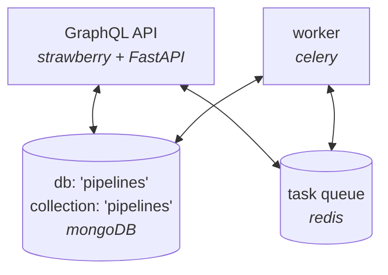

  <picture>
    <source media="(prefers-color-scheme: light)" srcset="https://raw.githubusercontent.com/cellsignal/kedro-graphql/refs/heads/main/docs/light-logo.png">
    <source media="(prefers-color-scheme: dark)" srcset="https://raw.githubusercontent.com/cellsignal/kedro-graphql/refs/heads/main/docs/dark-logo.png">
    
  </picture>

## Overview

Kedro-graphql is a [kedro-plugin](https://docs.kedro.org/en/stable/extend_kedro/plugins.html)
for serving kedro projects as a graphql api.  It leverages
[Strawberry](https://strawberry.rocks/), [FastAPI](https://fastapi.tiangolo.com/),
and [Celery](https://docs.celeryq.dev/en/stable/index.html) to turn any
 [Kedro](https://docs.kedro.org/en/stable/) project into a GraphqlQL api
 with features such as:

- a distributed task queue
- subscribe to pipline events and logs via GraphQL subscriptions
- storage
  - persist and track all pipelines executed via the API

Figure 1. Architecture
