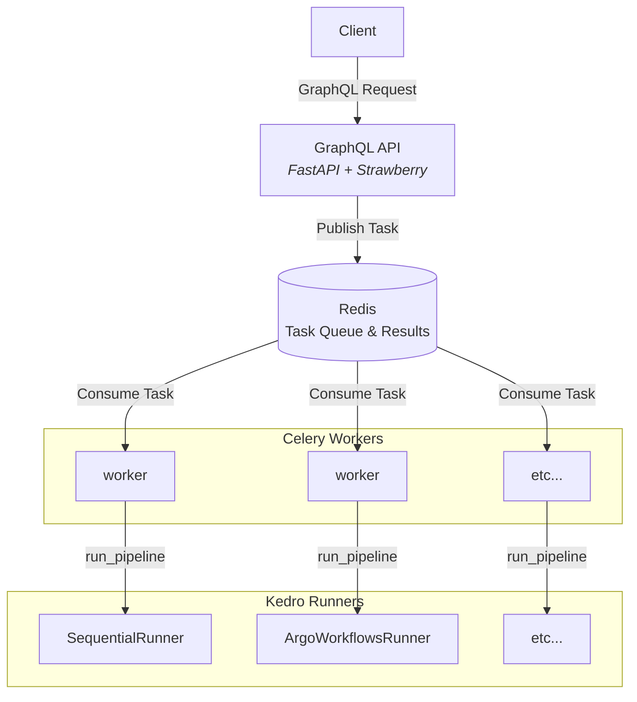
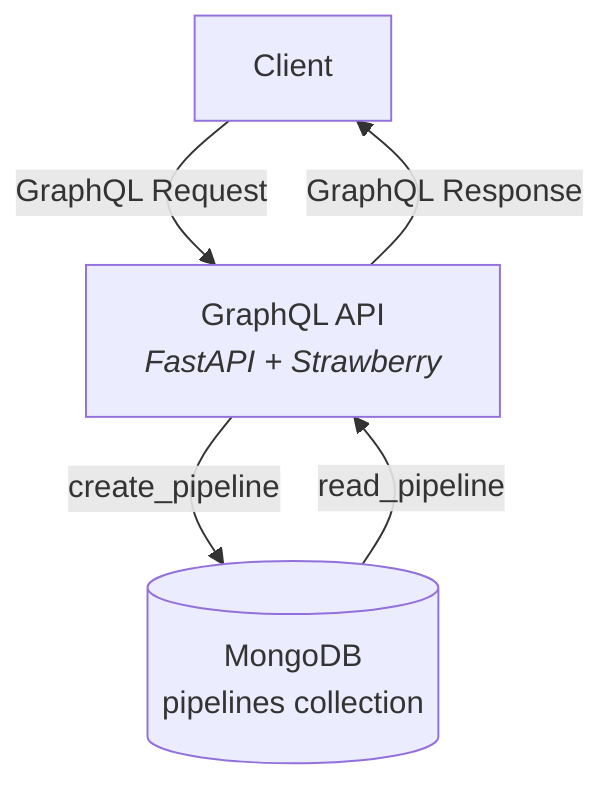
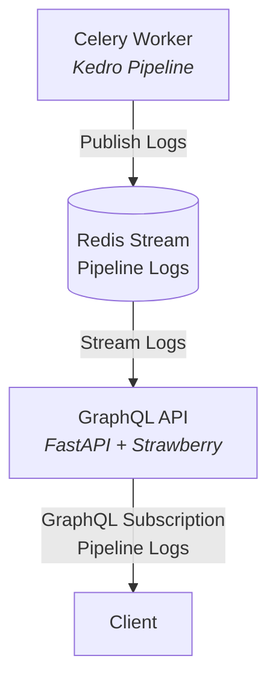

Kedro GraphQL leverages
[Strawberry](https://strawberry.rocks/), [FastAPI](https://fastapi.tiangolo.com/),
and [Celery](https://docs.celeryq.dev/en/stable/index.html) to turn any
 [Kedro](https://docs.kedro.org/en/stable/) project into a GraphqlQL API
 with features such as:

- a distributed task queue

  - Persist and track all pipeline executions, parameters, and results

  

- streaming pipeline logs via GraphQL subscriptions

- querying and mutating pipeline data in MongoDB

