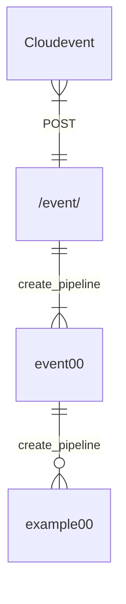

# Events

**Events are experimental**

The API provides a configurable `/event/` REST endpoint that supports
the [cloudevents](https://cloudevents.io/) 
[specification](https://github.com/cloudevents/spec/blob/v1.0.2/cloudevents/spec.md). 
It can be used to trigger a kedro pipeline if an event's `source`
and `type` attributes match what is provided in the configuration.


## Configuration

The configuration can be provided using the `KEDRO_GRAPHQL_EVENT_CONFIG`
environment variable.  If no value is provided the `/event/` endpoint 
is automatically disabled.  The configuration is a mapping between
a pipeline name and the expected `source` and `type` event attributes.
For example, the following configuration will run the `event00`
pipeline if the `event.source = "example.com"` and `event.type = "com.example.event"`

```python
"KEDRO_GRAPHQL_EVENTS_CONFIG" = {"event00": {
                                 "source": "example.com", "type": "com.example.event"
                                 }}
```

When providing the configuration as an environment variable be sure to serialize it
as a JSON string.  For example:

```
#.env

KEDROG_GRAPHQL_EVENTS_CONFIG='{"event00": {"source": "example.com", "type": "com.example.event"}}'
```

## Required Pipeline Parameters

For a kedro pipeline to be triggered by an event it must accept the following
parameters:

**id (str)**: The id of the current pipeline, this is useful for setting the `parent` attribute of any child pipelines.

**event (str)**: The cloudevent serialized as a JSON string


The `event00` pipeline included in the `kedro_graphql.pipelines` directory is
a basic example of how one might use the `event --> pipeline` pattern.  
The `event00` pipeline processes the event and starts a `example00` child pipeline.  

The tests for the events pattern leverage the `event00` and `example00` pipelines
 and can be run using:

```
pytest -s src/tests/test_asgi.py
```

The pattern can be expanded to address many different 
automation scenarios (*n x event --> n x event pipeline --> n x pipeline*).

*The following diagram is using the [Entity-relationship model](https://en.wikipedia.org/wiki/Entity%E2%80%93relationship_model)*



There is no requirment for the pipeline(s) triggered by the event 
to create any child pipelines, however, it can be a useful pattern
to encapsulate event processing logic and aligns well with the
[modular pipeline](https://docs.kedro.org/en/0.19.14/nodes_and_pipelines/modular_pipelines.html#modular-pipelines) approach recommended by the kedro project.

## Future Steps

- the event handler will pass the pipeline's id and the incoming event as
  parameters to pipeline.  Should we support loading and passing any additional
  parameters found in the PipelineTemplate?