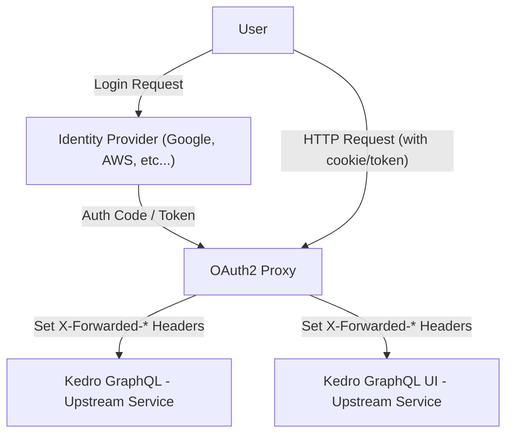

The `kedro-graphql` project uses the [OAuth2 Proxy](https://oauth2-proxy.github.io/oauth2-proxy/)
in conjunction with a configurable [Strawberry's permission class](https://strawberry.rocks/docs/guides/permissions) to enforce authentication and authorization.

## Authentication



Figure 1. OAuth2 Proxy with Identity Provider passing X-Forwarded-* headers to kedro-graphql

The OAuth2 proxy is configured to pass HTTP Basic Auth, X-Forwarded-User, X-Forwarded-Email and X-Forwarded-Preferred-Username information to upstream.


## Authorization with `kedro_graphql.permissions`

The `kedro_graphql.permissions` module provides a flexible, header-based permission system for the Kedro GraphQL API. It is designed to work seamlessly with OAuth2 proxy authentication and supports both simple authentication and advanced Role-Based Access Control (RBAC).

### Overview

- **Customizable permission logic:** You can use the provided permission classes or define your own custom Strawberry permission class to implement project-specific authentication and/or authorization logic.
- **Header-based authentication via Strawberry permission classes:** The project includes some permission classes that uses Strawberry's permission class system to enforce access controls by inspecting the HTTP headers (such as `X-Forwarded-Email`, `X-Forwarded-User`, and `X-Forwarded-Groups`) set by the OAuth2 proxy after successful authentication.
- **RBAC support:** Fine-grained access control is possible by mapping user groups to roles and roles to allowed actions via application configuration.

### Permission Classes

The following permission classes are included:

- **IsAuthenticatedAlways**
    - Grants access to all actions, regardless of authentication. Useful for development or open APIs.

- **IsAuthenticatedXForwardedEmail**
    - Grants access if the `X-Forwarded-Email` header is present in the request. This header is set by the OAuth2 proxy after user authentication.

- **IsAuthenticatedXForwardedRBAC**
    - Grants access based on the user's group membership and configured RBAC mappings. Checks the `X-Forwarded-Groups` header and verifies if the user's group is allowed to perform the requested action.

A custom permission class can be implemented by subclassing the `kedro_graphl.permissions.IsAuthenticatedAction` class.


### Available Actions

The following actions can be used in your RBAC configuration to control access to specific API operations:

- `create_pipeline`: Create a new pipeline in the system.
- `read_pipeline`: Read or fetch a single pipeline by its ID.
- `read_pipelines`: List or search all pipelines.
- `update_pipeline`: Update the configuration or metadata of an existing pipeline.
- `delete_pipeline`: Delete a pipeline from the system.
- `read_pipeline_template`: Fetch a single pipeline template.
- `read_pipeline_templates`: List or search all pipeline templates.
- `create_dataset`: Upload a dataset.
- `read_dataset`: Fetch or read a dataset's metadata or contents.
- `subscribe_to_events`: Subscribe to pipeline events (e.g., for monitoring or notifications).
- `subscribe_to_logs`: Subscribe to pipeline logs (e.g., for real-time log streaming).
- `create_event`: Create or emit a new event in the system (e.g., for custom integrations).

You can assign these actions to roles in your `permissions_role_to_action_mapping` section of the YAML config. Each action corresponds to a specific GraphQL operation.

### Usage Example

To configure permissions using the YAML API spec, set the relevant fields in your `api.yaml` configuration file:

```yaml
config:
  # ... other config ...
  permissions: "kedro_graphql.permissions.IsAuthenticatedXForwardedRBAC"
  permissions_role_to_action_mapping:
    admin:
      - "create_pipeline"
      - "read_pipeline"
      - "delete_pipeline"
    user:
      - "read_pipeline"
  permissions_group_to_role_mapping:
    admin-group:
      - admin
    user-group:
      - user
```

This configuration will:
- Use the `IsAuthenticatedXForwardedRBAC` permission class for all API actions.
- Map external groups (e.g., from your identity provider) to roles (`admin-group` → `admin`, `user-group` → `user`).
- Define which actions each role is allowed to perform.

No code changes are required to use these permissions—just update your YAML config and restart the API server.

#### Example: Minimal config for email-based authentication

```yaml
config:
  permissions: "kedro_graphql.permissions.IsAuthenticatedXForwardedEmail"
```

This will require only that the `X-Forwarded-Email` header is present for access.

### Example: Starting the API and UI with Authenticated Specs

To start the Kedro GraphQL API and UI using authenticated YAML specs, use the following commands:

```bash
# Start the API server with authentication
kedro gql --api-spec spec-api-auth.yaml

# Start the UI server with authentication
kedro gql --ui --ui-spec spec-ui-auth.yaml
```

Once started, you can open your web browser to access:

- **API GraphQL Playground:** [http://localhost:4180/graphql](http://localhost:4180/graphql)
- **Kedro GraphQL UI:** [http://localhost:4180/](http://localhost:4180/)

These endpoints will be protected by OAuth2 Proxy and require authentication as configured in your spec files.

!!! note 
    The OAuth2 Proxy must be running.
    ```docker compose up```

### How It Works

1. The OAuth2 proxy authenticates the user and sets the appropriate headers.
2. The permission class checks these headers and, if using RBAC, the configured mappings.
3. If the user is authorized, the resolver executes; otherwise, access is denied.

This system provides a robust and extensible way to secure your Kedro GraphQL API in production environments.

