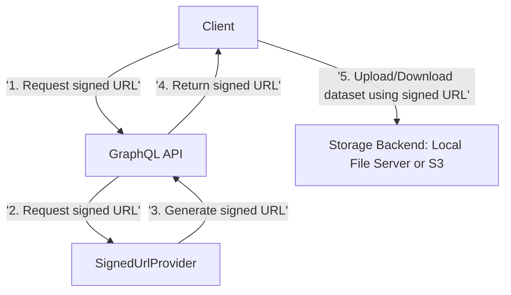

## Secure Dataset Uploads & Downloads with Signed URLs

Kedro-graphql enables secure, time-limited access to datasets for both upload and download operations using signed URLs. This approach allows clients to request a signed URL from the GraphQL API, which can then be used to interact directly with the storage backend (local file server or S3).

**Typical workflow:**

1. Client requests a signed URL for upload or download via a GraphQL mutation or query.
2. The API generates a signed URL and returns it to the client.
3. The client uses the signed URL to upload or download the dataset directly from the storage backend.

### Example Flow


## SignedUrlProvider

The `kedro_graphql.signed_url` module provides a standardized interface for generating signed URLs for reading and writing datasets. This enables secure, time-limited access to files for upload and download operations, commonly used for cloud storage and local file systems.

### Purpose

- Abstracts the logic for generating signed URLs for different storage backends.
- Allows the Kedro GraphQL API to support secure file transfers without exposing credentials or direct access.
- Supports both reading (download) and creating (upload) operations.


### Available Providers

- **LocalFileProvider**
    - Generates signed URLs for files stored on the local filesystem.
    - Uses JWT tokens to authorize access and uses the following REST endpoints:
        - `/upload`
        - `/download`


- **S3Provider**
    - Generates AWS S3 presigned URLs for objects in S3 buckets.
    - Uses AWS credentials and boto3 to create time-limited URLs for both upload (POST) and download (GET).

### How to Use

The provider is selected via configuration (e.g., in your config or YAML spec):

```yaml
config:
  KEDRO_GRAPHQL_SIGNED_URL_PROVIDER: "kedro_graphql.signed_url.s3_provider.S3Provider"
```

Or for local files:

```yaml
config:
  KEDRO_GRAPHQL_SIGNED_URL_PROVIDER: "kedro_graphql.signed_url.local_file_provider.LocalFileProvider"
```

The API will use the configured provider to generate signed URLs for dataset operations.

### Additional Configuration

You can further customize the behavior of signed URL providers using the following configuration attributes:

#### Common
- `KEDRO_GRAPHQL_SIGNED_URL_MAX_EXPIRES_IN_SEC`: Maximum allowed expiration time (in seconds) for any signed URL. Default is `43200` (12 hours).

#### LocalFileProvider
- `KEDRO_GRAPHQL_LOCAL_FILE_PROVIDER_SERVER_URL`: The base URL for the local file server (e.g., `http://localhost:5000`).
- `KEDRO_GRAPHQL_LOCAL_FILE_PROVIDER_JWT_SECRET_KEY`: Secret key used to sign JWT tokens for file access.
- `KEDRO_GRAPHQL_LOCAL_FILE_PROVIDER_JWT_ALGORITHM`: Algorithm used for JWT signing (e.g., `HS256`).
- `KEDRO_GRAPHQL_LOCAL_FILE_PROVIDER_DOWNLOAD_ALLOWED_ROOTS`: List of allowed root directories for downloads (e.g., `["./data", "/var"]`).
- `KEDRO_GRAPHQL_LOCAL_FILE_PROVIDER_UPLOAD_ALLOWED_ROOTS`: List of allowed root directories for uploads (e.g., `["./data"]`).
- `KEDRO_GRAPHQL_LOCAL_FILE_PROVIDER_UPLOAD_MAX_FILE_SIZE_MB`: Maximum allowed upload file size in megabytes (default: `10`).

#### S3Provider
- Uses standard AWS credentials and configuration via `boto3` (see [boto3 documentation](https://boto3.amazonaws.com/v1/documentation/api/latest/index.html)).
- No additional custom attributes are required; ensure your environment is configured for AWS access.


### Implementing a Custom SignedUrlProvider

To implement your own provider, create a new class that inherits from the `SignedUrlProvider` abstract base class and implement the required methods:

```python
from kedro_graphql.signed_url.base import SignedUrlProvider

class MyCustomProvider(SignedUrlProvider):

    def read(info: Info, dataset: DataSet, expires_in_sec: int) -> str | None:
        """
        Method to get a signed URL for downloading a dataset.

        Args:
            info (Info): Strawberry GraphQL Info object.
            dataset (DataSet): The dataset for which to create a signed URL.
            expires_in_sec (int): The number of seconds the signed URL should be valid for.

        Returns:
            str | None: A signed URL for downloading the dataset.
        """
        # Your logic to generate a signed URL for reading
        pass

    def create(info: Info, dataset: DataSet, expires_in_sec: int) -> dict | None:
        """
        Method to get a signed URL for uploading a dataset.

        Args:
            info (Info): Strawberry GraphQL Info object.
            dataset (DataSet): The dataset for which to create a signed URL.
            expires_in_sec (int): The number of seconds the signed URL should be valid for.

        Returns:
            dict | None: A dictionary with the URL to post to and form fields and values to submit with the POST.
        """
        # Your logic to generate a signed URL for uploading
        pass

```

- `read`: Should return a signed URL for downloading the dataset.
- `create`: Should return a dictionary with the upload URL and any required form fields for uploading the dataset.

Once implemented, set your provider in the configuration:

```yaml
config:
  KEDRO_GRAPHQL_SIGNED_URL_PROVIDER: "path.to.MyCustomProvider"
```

This allows the API to use your custom logic for generating signed URLs for dataset operations.

