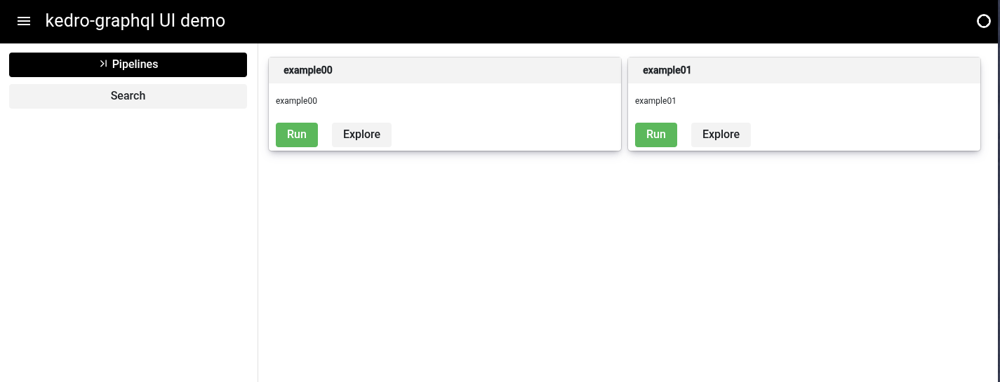
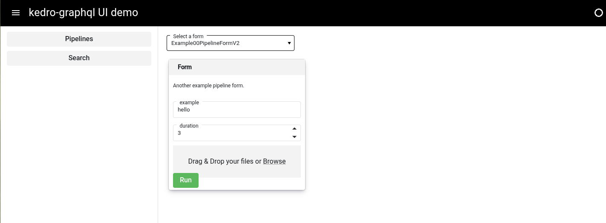
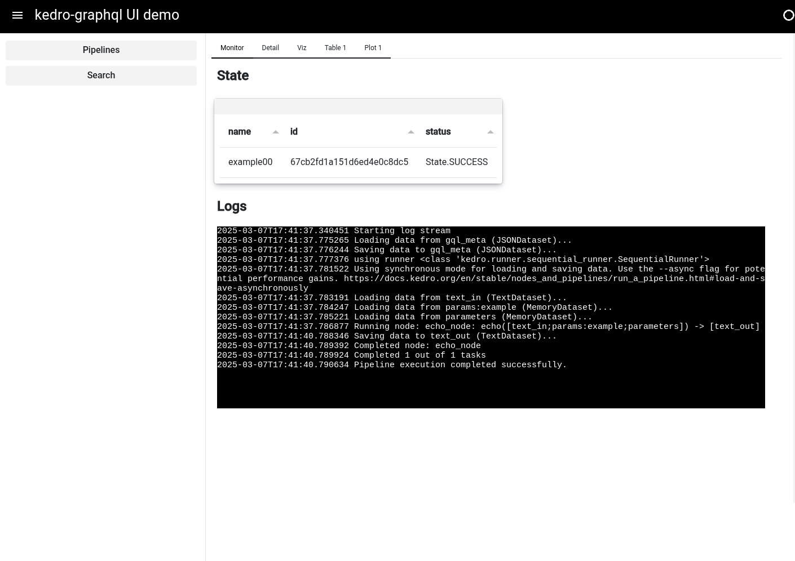
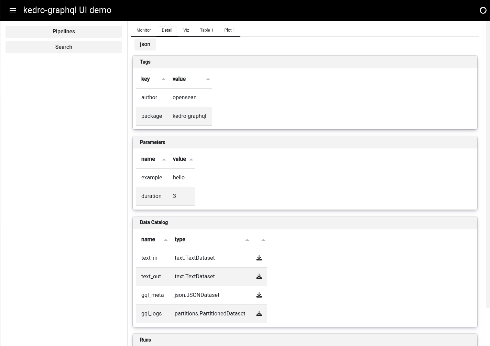
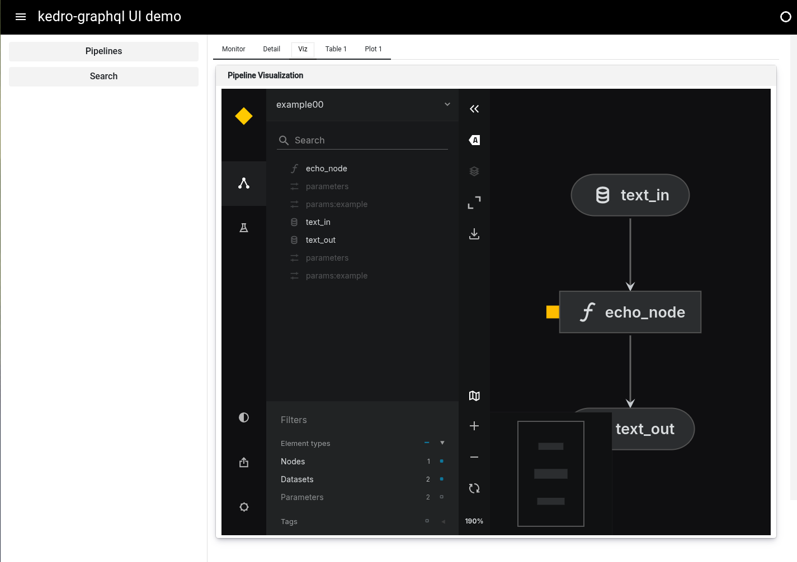
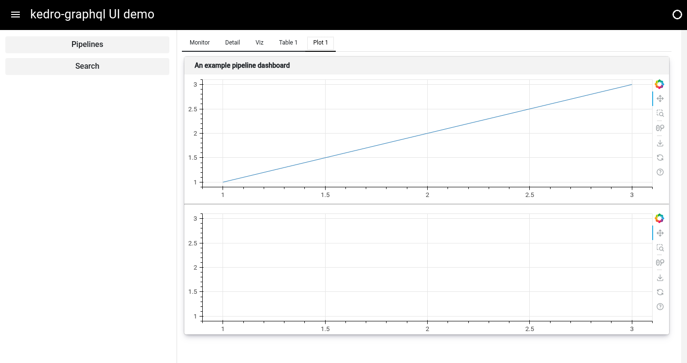
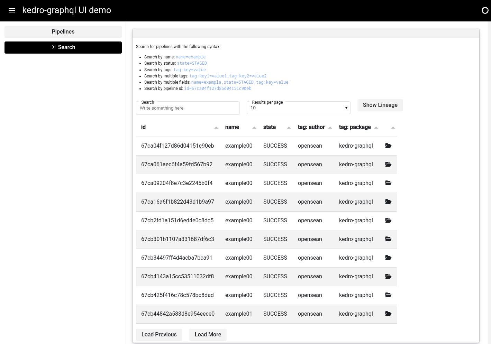
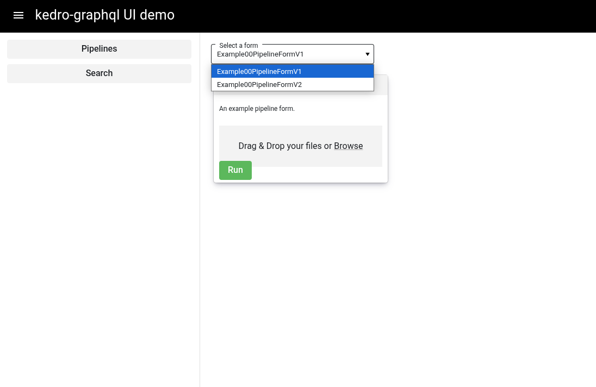

# UI

**The user interface is experimental**

The `kedro_graphql.ui` module provides a graphical user interface
for the kedro-graphql project.  It is built with the [Panel](https://panel.holoviz.org/index.html)
data exploration and web app framework for python.


## Getting Started

### Installation

Clone the repository and install the dependencies,

```
pip install -e .[ui]
```

Once released, the UI dependencies will installable via pip.

```
pip install kedro_graphql[ui]
```

### Start the UI

Start the UI server.

```
kedro gql --ui --imports "kedro_graphql.ui.plugins"
```

Shorthand flags and auto-reloading (for development) are also supported.

```
kedro gql -r -u -i "kedro_graphql.ui.plugins"
```

Start the GraphQL API.
```
kedro gql -r 
```

Start a worker.
```
kedro gql -r -w
```

Start mongodb and redis.
```
docker compose up -d
```

## Overview

### Cards

Each pipeline with at least one registered `@ui_form` [plugin](#plugins) will be
displayed as a card on the "pipelines" page.



### Forms

Clicking the "Run" button of a pipeline card will load all `@ui_form` plugins
registered to the pipeline.  A user can select which form
to use from the dropdown menu.




### Default Dashboard

After completing the form and clicking the "Run" button the
pipeline dashboard will load a default dashboard with the following tabs:

**Monitor**

Track a pipeline's state and view a live log stream.



**Detail**

View pipeline information including tags, parameters, data catalog, and all runs.



**Viz**

Visualize the pipeline with [kedro-viz](https://github.com/kedro-org/kedro-viz).



**Adding Custom Tabs the default dashboard**

Additional tabs with custom components can be added to a pipeline's dashboard 
by registering one or more `@ui_data` [plugins](#plugins).



### Custom Dashboards

The default dashboard can be replaced using the `@ui_dashboard` decorator.

### Search

The search component can be used to search the entire pipeline collection.




## Plugins & Customization

Currently, the functionality of the UI can be customized using the following approaches:

- Use the `@ui_form` and `@ui_data` plugins to add custom tabs to the default dashboard of a pipeline.  
- Use the `@ui_dashboard` plugin to replace the default dashboard with your own implementation.  

Plugins can be imported when starting the UI application using the `-i` or 
`--imports` cli flags.  For example:

```
kedro gql --ui --imports "kedro_graphql.ui.plugins"
```

### @ui_form

The `@ui_form` decorator can be used to register one or more forms to
a pipeline.  The specification of `@ui_form` plugin is as follows:

```
class ExampleForm(pn.viewable.Viewer):
    client = param.ClassSelector(class_=KedroGraphqlClient)
    dashboard = param.String(default="dashboard")

    def __panel__(self):
        raise NotImplementedError
```


The example shown below will register two forms to the 
`example00` pipeline.

```
# kedro_graphql.ui.plugins

import tempfile
from tempfile import _TemporaryFileWrapper
import param
import panel as pn
from kedro_graphql.ui.decorators import ui_form
from kedro_graphql.client import KedroGraphqlClient
from kedro_graphql.models import PipelineInput
import json
pn.extension('filedropper')


class BaseExample00Form(pn.viewable.Viewer):
    client = param.ClassSelector(class_=KedroGraphqlClient)
    dashboard = param.String(default="dashboard")
    text_in = param.ClassSelector(
        class_=_TemporaryFileWrapper, default=None)
    text_out = param.ClassSelector(
        class_=_TemporaryFileWrapper, default=None)
    duration = param.Number(default=3)
    example = param.String(default="hello")

    def navigate(self, pipeline_id: str):
        pn.state.location.search = "?component=" + \
            self.dashboard+"&pipeline=example00&id=" + pipeline_id

    async def upload(self, file_dropper):
        """write a files contens to a temporary file"""
        for k, v in file_dropper.items():
            self.text_in = tempfile.NamedTemporaryFile(delete=False)
            self.text_out = tempfile.NamedTemporaryFile(delete=False)
            with open(self.text_in.name, "w") as f:
                f.write(v)
            print(f"Uploaded {k} to {self.text_in.name}")

    @param.depends("text_in", "text_out", 'duration', 'example')
    async def pipeline_input(self):

        input_dict = {"type": "text.TextDataset", "filepath": self.text_in.name}
        output_dict = {"type": "text.TextDataset",
                       "filepath": self.text_out.name}

        # PipelineInput object
        return PipelineInput(**{
            "name": "example00",
            "state": "READY",
            "data_catalog": [{"name": "text_in", "config": json.dumps(input_dict)},
                             {"name": "text_out", "config": json.dumps(output_dict)}],
            "parameters": [{"name": "example", "value": self.example},
                           {"name": "duration", "value": str(self.duration), "type": "FLOAT"}],
            "tags": [{"key": "author", "value": "opensean"}, {"key": "package", "value": "kedro-graphql"}]
        })

    async def run(self, event):
        p_input = await self.pipeline_input()
        result = await self.client.create_pipeline(p_input)
        self.navigate(result.id)

    def __panel__(self):
        raise NotImplementedError


@ui_form(pipeline="example00")
class Example00PipelineFormV1(BaseExample00Form):

    def __init__(self, **params):
        super().__init__(**params)

    def __panel__(self):
        run_button = pn.widgets.Button(name='Run', button_type='success')
        file_dropper = pn.widgets.FileDropper(multiple=False)
        pn.bind(self.upload, file_dropper, watch=True)
        pn.bind(self.run, run_button, watch=True)

        form = pn.Card(
            "An example pipeline form.",
            pn.Row(
                file_dropper
            ),
            pn.Row(
                run_button
            ),
            sizing_mode="stretch_width",
            title='Form')

        return form


@ui_form(pipeline="example00")
class Example00PipelineFormV2(BaseExample00Form):

    def __init__(self, **params):
        super().__init__(**params)

    def __panel__(self):
        run_button = pn.widgets.Button(name='Run', button_type='success')
        file_dropper = pn.widgets.FileDropper(multiple=False)
        pn.bind(self.upload, file_dropper, watch=True)
        pn.bind(self.run, run_button, watch=True)
        form = pn.Card(
            "Another example pipeline form.",
            pn.Row(
                pn.widgets.TextInput.from_param(
                    self.param.example, name='example', placeholder='Enter a string here...'),
            ),
            pn.Row(
                pn.widgets.NumberInput.from_param(
                    self.param.duration, name='duration', placeholder='Enter a number here...')
            ),
            pn.Row(
                file_dropper
            ),
            pn.Row(
                run_button
            ),
            sizing_mode="stretch_width",
            title='Form')

        return form
```




### @ui_data

The `@ui_data` decorator can be used to register one or more custom components to
a pipeline's dashboard. The specification of `@ui_data` plugin is as follows:

```
class ExampleData(pn.viewable.Viewer):
    client = param.ClassSelector(class_=KedroGraphqlClient)
    pipeline = param.ClassSelector(class_=Pipeline)
    title = param.String(default="Table 1")

    def __panel__(self):
        raise NotImplementedError
```

 The example shown below will register two new tabs to the 
`example00` pipeline dashboard.

```
# kedro_graphql.ui.plugins
import panel as pn
import numpy as np
from bokeh.plotting import figure
import param
from kedro_graphql.models import Pipeline
from kedro_graphql.ui.decorators import ui_data

pn.extension('tabulator', css_files=[
             "https://cdnjs.cloudflare.com/ajax/libs/font-awesome/6.4.2/css/all.min.css"])

@ui_data(pipeline="example00")
class Example00Data00(pn.viewable.Viewer):
    id = param.String(default="")
    pipeline = param.ClassSelector(class_=Pipeline)
    title = param.String(default="Table 1")

    def __panel__(self):

        # Create a sample DataFrame
        data = {
            'col1': np.random.randint(0, 10, 5),
            'col2': np.random.rand(5),
            'col3': ['A', 'B', 'A', 'C', 'B']
        }

        df = pd.DataFrame(data)

        df_widget = pn.widgets.Tabulator(df,
                                         theme='materialize',
                                         show_index=False)
        return pn.Card(df_widget)


@ui_data(pipeline="example00")
class Example00Data01(pn.viewable.Viewer):
    id = param.String(default="")
    pipeline = param.ClassSelector(class_=Pipeline)
    title = param.String(default="Plot 1")

    def __panel__(self):

        p1 = figure(height=250, sizing_mode='stretch_width', margin=5)
        p2 = figure(height=250, sizing_mode='stretch_width', margin=5)

        p1.line([1, 2, 3], [1, 2, 3])
        p2.circle([1, 2, 3], [1, 2, 3])

        c1 = pn.Card(p1, pn.layout.Divider(), p2,
                     title="An example pipeline dashboard", sizing_mode='stretch_width')
        return c1
```


### @ui_dashboard

The `@ui_dashboard` decorator can be used to register one or more dashboards to
a pipeline that replace the default dashboard.  The specification of 
`@ui_dashboard` plugin is as follows:

```
class ExampleDashboard(pn.viewable.Viewer):
    client = param.ClassSelector(class_=KedroGraphqlClient)
    id = param.String(default="")
    pipeline = param.ClassSelector(class_=Pipeline)
    viz_static = param.String(default="")

    def __panel__(self):
        raise NotImplementedError
```

The example shown below will register one custom dashboard to the 
`example01` pipeline that will replace the default dashboard.

```
# kedro_graphql.ui.plugins
import panel as pn
import numpy as np
import param
import plotly.graph_objects as go
from kedro_graphql.models import Pipeline
from kedro_graphql.ui.decorators import ui_dashboard

pn.extension('plotly')

@ui_dashboard(pipeline="example01")
class Example00PipelineUIV1(pn.viewable.Viewer):

    client = param.ClassSelector(class_=KedroGraphqlClient)
    id = param.String(default="")
    pipeline = param.ClassSelector(class_=Pipeline)
    viz_static = param.String(default="")

    def __init__(self, **params):
        super().__init__(**params)

    def draw_pipeline(self):
        nodes = ["stage 1", "stage 2", "stage 3"]
        # it would be nice to get nodes from the pipeline object instead

        # Define node colors, default color is blue
        node_colors = ['blue'] * len(nodes)
        node_colors[1] = 'green'  # Change color of the second node to green

        # Define edges as tuples of node indices
        node_trace = go.Scatter(
            x=nodes,
            y=[0, 0, 0],
            mode='lines+markers',
            text=[nodes],
            marker=dict(
                size=20,
                color=node_colors
            ),
            line=dict(width=2, color='gray'),
            textposition='bottom center'
        )
        fig = go.Figure(data=[node_trace],
                        layout=go.Layout(showlegend=False))

        fig.update_layout({
            "plot_bgcolor": "rgba(0, 0, 0, 0)",
            "paper_bgcolor": "rgba(0, 0, 0, 0)",
            'xaxis': {'showgrid': False, 'zeroline': False, 'showticklabels': True},
            'yaxis': {'showgrid': False, 'zeroline': False, 'showticklabels': False},
            'hovermode': False,
            'height': 100,
            'margin': dict(t=0, b=0, l=0, r=0),
        })
        return pn.pane.Plotly(fig, config={'displayModeBar': False, 'scrollZoom': False})

    @param.depends("client", "pipeline")
    async def build_ui(self):
        yield pn.indicators.LoadingSpinner(value=True, width=25, height=25)
        monitor = PipelineMonitor(client=self.client, pipeline=self.pipeline)
        ui = pn.Column(
            pn.Row(self.draw_pipeline()),
            pn.Row(monitor),
            sizing_mode="stretch_width")

        yield ui

    def __panel__(self):

        pn.state.location.sync(self, {"id": "id"})
        return self.build_ui
```

### Component Map

The layout and registration of components can also be specified in the 
`KEDRO_GRAPHQL_UI_COMPONENT_MAP` configuration value.  The default 
configration is as follows:

```
"KEDRO_GRAPHQL_UI_COMPONENT_MAP": {
    "dashboard": {"sidebar": False, "component": "kedro_graphql.ui.components.pipeline_dashboard_factory.PipelineDashboardFactory", "params": ["client", "pipeline", "viz_static"]},
    "pipelines": {"sidebar": True, "component": "kedro_graphql.ui.components.pipeline_cards.PipelineCards", "params": []},
    "form": {"sidebar": False, "component": "kedro_graphql.ui.components.pipeline_form_factory.PipelineFormFactory", "params": ["component", "client", "pipeline"]},
    "search": {"sidebar": True, "component": "kedro_graphql.ui.components.pipeline_search.PipelineSearch", "params": ["client"]},
    "explore": {"sidebar": False, "component": "kedro_graphql.ui.components.pipeline_viz.PipelineViz", "params": ["viz_static, pipeline"]},
}
```

- Each key in the dictionary is the name displayed on the button in the navigation sidebar
  (if "sidebar": True) and  to use for the url parameters when loaded e.g. `http://localhost:5006/?component=dashboard`
- `component`: a valid import path
- `params`: a list of parameters the parent application should pass to the component, can include ["client", "component", "id", "pipeline", "viz_static"]
  - `client` (kedro_graphql.client.KedroGraphqlClient): a KedroGraphqlClient instance
  - `component` (str): name of the component
  - `id` (str): id of the pipeline
  - `pipeline` (str): name of the pipeline
  - `viz_static` (str): path to static build of kedro viz 