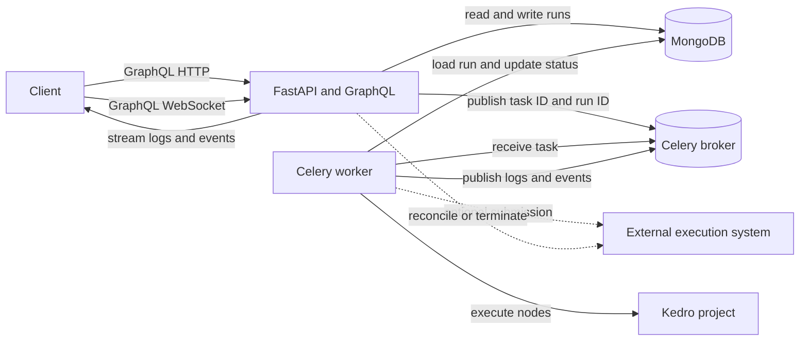

# Kedro GraphQL user guide

Kedro GraphQL turns registered Kedro pipelines into a remote execution API. A
client chooses a pipeline, supplies values specific to one run, and uses
GraphQL to create, inspect, update, abort, or delete that run. The API stores
the complete execution definition in MongoDB and uses Celery to perform the
work.

This guide is for developers who call the API and developers who host Kedro
GraphQL or add custom runners.

## The two meanings of pipeline

The word *pipeline* is used for two related objects:

- A **pipeline template** is a registered Kedro pipeline exposed by the server.
  It describes the nodes, expected inputs and outputs, and default parameters.
- A **pipeline run** is a stored request to execute one template. It has its
  own ID, resolved catalog and parameters, status history, tags, and task
  identity.

Templates are read-only. Runs support create, read, update, and delete
operations. This guide uses *template* and *run* when the distinction matters.

## Architecture

Kedro GraphQL has five main parts:

| Part | Responsibility |
| --- | --- |
| Kedro project | Supplies registered pipelines, nodes, configuration, datasets, parameters, and hooks. |
| FastAPI and GraphQL | Authenticate requests, validate input, resolve run configuration, and expose queries, mutations, and subscriptions. |
| MongoDB | Stores the durable pipeline-run record and its complete status history. |
| Celery and its broker | Queue work, report task events, and carry abort requests. |
| Worker | Reload the stored run, build the Kedro runtime, execute it, and record the result. |

The API and worker must use the same Kedro project code, configuration mapping,
MongoDB backend, and Celery broker.



### Startup

The API bootstraps the Kedro project, reads its registered pipelines, and
checks `pipeline_config_sources`. Each mapping key is a pipeline exposed
through the API. Each value is the Kedro configuration root for that pipeline.

```yaml
config:
  env: local
  pipeline_config_sources:
    example00: conf
    example01: conf
```

An empty mapping fails startup. A key that does not match a registered pipeline
also fails startup. Relative paths are resolved from the Kedro project root.
The server loads enough configuration at startup to describe templates.
Execution sessions are created later, one run at a time.

## From API request to Celery execution

A `READY` submission follows this sequence:

1. The API verifies that the requested template is exposed.
2. It applies any requested pipeline slice.
3. It loads server-owned catalog and parameter defaults from that pipeline's
   configured source.
4. It merges client overrides into those defaults.
5. It resolves dataset factory patterns and keeps only configuration used by
   the selected nodes.
6. It rejects missing inputs, invalid datasets, embedded credentials,
   non-JSON values, and an oversized resolved payload.
7. It reserves both the MongoDB run ID and Celery task ID.
8. It generates requested unique dataset paths.
9. It stores the final run with state `READY`.
10. It publishes a Celery task containing the run ID and request-only slicing
    controls.

The store happens before the publish. A fast worker can always load the run,
and a broker publication error can be recorded as `FAILURE` against the known
task ID.

The Celery message does not carry another copy of the catalog, parameters,
runner, or hooks. The worker reloads those values from MongoDB. The stored run
is the execution contract.

### Worker execution

Before execution, the task changes the current status from `READY` to
`STARTED`, records Celery details, creates a Kedro session for the selected
configuration source, and determines the nodes that will run.

The worker then starts a child process. That child owns:

- the selected Kedro pipeline;
- the execution catalog;
- the runner;
- the hook manager; and
- the actual node execution.

Keeping these objects in one process means hooks and the runner see the same
catalog. The parent Celery task supervises the child, forwards extension
metadata to MongoDB, watches for abort requests, and records the final result.

For a normal local runner, successful completion becomes `SUCCESS`; an
exception becomes `FAILURE`. Tracebacks from the child are retained in the
status record.

## Data model

### Pipeline template

A template exposes:

- `id` and `name`: both use the registered pipeline name;
- `describe`: Kedro's text description of execution order;
- `nodes`: node names, inputs, outputs, and tags;
- `parameters`: resolved defaults used by the template;
- `inputs` and `outputs`: configured boundary datasets.

Template IDs are stable as long as pipeline names stay stable. Template lists
are sorted by name and use cursor pagination.

### Pipeline run

A stored `Pipeline` contains:

| Field | Meaning |
| --- | --- |
| `id` | MongoDB object ID for this durable run record. |
| `name` | Registered template name. It cannot be changed after creation. |
| `dataCatalog` | Resolved dataset configuration used by the run. |
| `parameters` | Resolved parameters used by the run. |
| `describe` and `nodes` | Topology derived from the selected template and slice. |
| `status` | Ordered history of execution attempts. The last item is current. |
| `tags` | Client-defined key/value labels for search and organization. |
| `parent` | Optional ID of a related parent run. |
| `hooks` | Validated Kedro hook entry-point names used for this run. |
| version fields | Project, pipeline package, and Kedro GraphQL versions when available. |
| `createdAt` | UTC creation time for the run record. |

Every persisted run must have at least one status. Python code should read
`pipeline.current_status` instead of indexing `status[-1]`.

Supported fields are decoded strictly. Unknown stored entity fields raise an
error rather than disappearing silently.

### Parameters and datasets

GraphQL represents parameters as a name, string value, and type:

```python
ParameterInput(name="retries", value="3", type=ParameterType.INTEGER)
```

Supported types are `STRING`, `BOOLEAN`, `INTEGER`, `FLOAT`, and `JSON`.
`JSON` covers objects and arrays. Dotted names such as `options.retries`
update nested server defaults.

A dataset configuration is a JSON string:

```python
DataSetInput(
    name="report",
    config='{"type":"pandas.CSVDataset","filepath":"data/08_reporting/report.csv"}',
)
```

The API parses this string, combines it with server configuration, resolves
Kedro dataset factory patterns, and stores the resolved JSON. A
`PipelineInput` rejects duplicate parameter names and duplicate dataset names.

### Status history and state

The current status stores the state plus execution details such as runner,
Celery task ID, session ID, selected nodes, timestamps, result, exception,
traceback, and external-runner metadata.

The allowed transitions are:

| Current state | Next state |
| --- | --- |
| `STAGED` | `READY` |
| `READY` | `STARTED`, `ABORTING`, or `FAILURE` |
| `STARTED` | `RETRY`, `ABORTING`, `ABORTED`, `FAILURE`, or `SUCCESS` |
| `RETRY` | `STARTED`, `ABORTING`, `ABORTED`, or `FAILURE` |
| `ABORTING` | `ABORTED` |

`SUCCESS`, `FAILURE`, and `ABORTED` are terminal states for one attempt.
Submitting the same run again starts another attempt with a new status entry.

When a terminal run is submitted again, a new status entry represents the new
attempt. The run keeps the same pipeline ID and name, while each attempt gets a
new Celery task ID.

Status changes use a guarded database update. The write succeeds only if the
stored state and status-history length still match what the caller read. This
prevents a late worker callback from overwriting a newer attempt.

Timestamps are normalized to UTC. Clients should convert them only when
formatting for a user.

## Python client

`KedroGraphqlClient` is asynchronous. It uses HTTP for queries and mutations
and WebSockets for subscriptions.

```python
import asyncio

from kedro_graphql.client import KedroGraphqlClient
from kedro_graphql.models import (
    ParameterInput,
    ParameterType,
    PipelineInput,
    PipelineInputStatus,
    TagInput,
)


async def main():
    client = KedroGraphqlClient(
        uri_graphql="http://localhost:5000/graphql",
        uri_ws="ws://localhost:5000/graphql",
        headers={"Authorization": "Bearer example-token"},
    )
    try:
        request = PipelineInput(
            name="example00",
            state=PipelineInputStatus.READY,
            parameters=[
                ParameterInput(
                    name="example",
                    value="hello",
                    type=ParameterType.STRING,
                )
            ],
            tags=[TagInput(key="owner", value="api-example")],
        )
        run = await client.create_pipeline(request)
        print(run.id, run.current_status.state)
    finally:
        await client.close_sessions()


asyncio.run(main())
```

The client can also receive cookies through its `cookies` argument. If URIs
are omitted, it uses `client_uri_graphql` and `client_uri_ws` from
`KedroGraphQLConfig`.

### Discover templates

The typed client does not wrap template queries. Use `execute_query()` when a
client needs to discover the exposed pipelines:

```python
result = await client.execute_query(
    """
    query {
      pipelineTemplates(limit: 20) {
        pipelineTemplates {
          id
          name
          describe
          parameters { name value type }
          inputs { name config }
          outputs { name config }
        }
        pageMeta { nextCursor }
      }
    }
    """
)
```

Pass the returned `nextCursor` into another template query to fetch the next
page. A single template is available through `pipelineTemplate(id: ...)`.

### Build a request from mappings

For common values, `PipelineInput.create()` is shorter:

```python
request = PipelineInput.create(
    name="example00",
    parameters={"example": "hello", "options": {"retries": 3}},
    tags={"owner": "api-example"},
)
request.state = PipelineInputStatus.READY
run = await client.create_pipeline(request)
```

Server defaults mean most callers should not send the full catalog and
parameter set. Send only values that differ for this invocation, plus any free
input introduced by slicing.

## CRUD operations

### Create

`create_pipeline()` accepts a `PipelineInput`, an optional list of dataset
names for unique path generation, and `dry_run`.

Create with `STAGED` when another step must upload data or finish the run
definition before execution:

```python
request = PipelineInput(name="example00", state=PipelineInputStatus.STAGED)
staged = await client.create_pipeline(request)
```

Create with `READY` to store and submit immediately:

```python
request.state = PipelineInputStatus.READY
submitted = await client.create_pipeline(request)
```

Use `dry_run=True` to resolve and validate the projected result without storing
it or publishing a task:

```python
projected = await client.create_pipeline(request, dry_run=True)
assert projected.id is None
```

A dry-run create has no durable ID or Celery task ID. It cannot produce final
identity-based unique paths.

The optional `unique_paths` argument names datasets whose `filepath` or `path`
should be made unique for this run. The API reserves the run ID first and
stores only the final paths, so the response, database record, and worker all
see the same values.

### Read one

```python
run = await client.read_pipeline(str(submitted.id))
print(run.current_status.state)
print(run.current_status.filtered_nodes)
```

Reading an external run also asks its runner to reconcile the stored state with
the external system. A read can therefore persist a newly confirmed external
state or metadata.

### Read many

```python
page = await client.read_pipelines(
    limit=20,
    filter='{"tags":{"$elemMatch":{"key":"owner","value":"api-example"}}}',
    sort="[(\\"created_at\\", -1)]",
)

for run in page.pipelines:
    print(run.id, run.name, run.current_status.state)

if page.page_meta.next_cursor:
    next_page = await client.read_pipelines(
        limit=20,
        cursor=page.page_meta.next_cursor,
    )
```

`filter` is a MongoDB query encoded as JSON. `sort` is a string representation
of a list of `(field, direction)` tuples. These expressions are backend-aware;
clients should not assume they are portable to another persistence backend.

List reads return stored data. Unlike a single read, the list path does not
reconcile each external run.

### Update and run again

Start with a fresh input or convert a returned run:

```python
request = run.to_input()
request.state = PipelineInputStatus.READY
request.replace_parameter(
    ParameterInput(
        name="example",
        value="updated",
        type=ParameterType.STRING,
    )
)
updated = await client.update_pipeline(str(run.id), request)
```

Likewise, use `request.replace_dataset(DataSetInput(...))` to replace a
catalog entry without creating a duplicate name. Both methods raise
`ValueError` if the name is not already present.

The name in the input must match the stored name. An update refreshes the
resolved catalog, parameters, description, nodes, tags, parent, and hooks.

Changing a `STAGED` run to `READY` submits its first attempt. Changing a
terminal run to `READY` appends a new attempt and submits it with a new task
ID. Updating a currently active run does not publish another task; avoid
editing active runs because the worker may already have loaded the previous
definition.

`update_pipeline(..., dry_run=True)` validates and returns a projection without
writing or publishing.

### Abort

Abort is represented as an update:

```python
abort_request = run.to_input()
abort_request.state = PipelineInputStatus.ABORTED
aborting = await client.update_pipeline(str(run.id), abort_request)
```

The API records `ABORTING` before it sends the abort request. For a local
runner, the parent worker sends `SIGINT` to the child process, then escalates
to `SIGTERM` and `SIGKILL` if it does not stop within the configured grace
period. The worker records `ABORTED` only after execution has stopped.

Abort is idempotent for runs already in `ABORTING` or `ABORTED`. It is rejected
for states that are not active and for malformed active records without a task
ID.

### Delete

```python
deleted = await client.delete_pipeline(str(run.id))
```

Delete returns the removed run. If work is active, the service first requests
termination. It removes the record only after a terminal state is confirmed.
This matters because the run record may contain the only durable identifier
for external work.

Deleting a run is permanent at the API level. Keep records needed for audit or
result discovery.

## Slicing and only-missing execution

Use `slices` to select part of a Kedro pipeline:

```python
from kedro_graphql.models import PipelineSlice, PipelineSliceType

request.slices = [
    PipelineSlice(
        slice=PipelineSliceType.NODE_NAMES,
        args=["first_node", "second_node"],
    )
]
```

Available slice types correspond to Kedro filters: tags, starting nodes, ending
nodes, exact node names, starting inputs, ending outputs, and node namespace.

Slicing can change which datasets are free inputs. If the slice removes the
node that normally creates a dataset, that dataset must be supplied by server
configuration or as a client catalog override.

Set `only_missing=True` to build a dynamic pipeline containing outputs that do
not yet exist and the nodes needed to produce them. Final validation for this
mode happens in the worker because dataset existence is checked at execution
time.

## Hooks

The request's `hooks` list contains installed `kedro.hooks` entry-point names,
not Python object paths. Unknown names are rejected. Hooks configured in
`always_hooks` are added to every request, and duplicate names are removed.

The child execution process creates the hook manager and passes the same
catalog to hooks and the runner.

## Dataset upload and download

The client provides:

- `create_datasets()` for upload URLs on a `STAGED` run;
- `read_datasets()` for download URLs;
- partition selection for partitioned datasets; and
- `list_partitions=True` to discover available partitions.

Signed URLs are produced by the configured provider. The built-in local file
provider uses short-lived JWTs and `/upload` or `/download` HTTP endpoints.
Production applications can supply another `SignedUrlProvider`.

The requested expiry cannot exceed `signed_url_max_expires_in_sec`. Local file
access is also limited by configured upload and download roots. A dataset name
that is not present in the run's catalog produces `None` rather than a URL.

## Events and logs

Use the pipeline event subscription for Celery task progress:

```python
async for event in client.pipeline_events(str(run.id)):
    print(event.status, event.result)
```

Use the log subscription for task-scoped log messages:

```python
async for message in client.pipeline_logs(str(run.id)):
    print(message.time, message.message)
```

Subscriptions require a task ID, so a purely `STAGED` run has nothing to
stream. Configure both HTTP and WebSocket client URIs, and make sure the broker
and result backend retain enough task state for late subscribers.

When `events_config` is enabled, the REST `/event/` endpoint can map a
CloudEvent source and type to one or more pipeline names. Each match creates a
normal `READY` run with event information in its parameters and tags.

## External runners

An external runner starts work in a system whose lifetime is not bounded by
the Celery task. The framework does not include a backend-specific runner.
Applications supply one using the generic lifecycle.

The runner class must be importable by both the API and worker. It must satisfy
the Kedro runner interface and inherit `ExternalRunnerLifecycle`:

```python
from kedro.runner import AbstractRunner

from kedro_graphql.models import State
from kedro_graphql.runners import ExternalRunnerLifecycle


class ExampleRemoteRunner(ExternalRunnerLifecycle, AbstractRunner):
    supports_memory_datasets = False

    def _run(self, pipeline, catalog, hook_manager, session_id):
        job_id = submit_to_remote_system(pipeline, catalog)
        self.emit_metadata({"x-job-id": job_id})
        return {}

    def reconcile(self):
        job_id = self.run_context["metadata"]["x-job-id"]
        state = read_remote_state(job_id)
        if state == "succeeded":
            return State.SUCCESS
        if state == "failed":
            return State.FAILURE
        if state == "cancelled":
            return State.ABORTED
        return None

    def terminate(self):
        job_id = self.run_context["metadata"]["x-job-id"]
        request_remote_cancellation(job_id)
```

The exact `AbstractRunner` methods depend on the installed Kedro version. The
Kedro GraphQL additions are `emit_metadata`, `run_context`, `reconcile()`, and
`terminate()`.

### Durable runner metadata

The framework injects `emit_metadata(mapping)` before `run()`. Use it as soon
as the external system returns a durable identifier:

```python
self.emit_metadata({"x-job-id": "job-123"})
```

Keys must start with `x-`, and values must be strings. Later calls with the same
key replace its value. Stored metadata is available after worker restarts and
is passed back through:

```python
self.run_context == {
    "pipeline_id": "...",
    "task_id": "...",
    "metadata": {"x-job-id": "job-123"},
}
```

Do not keep the only copy of an external job ID in runner memory.

### Reconciliation

`reconcile()` inspects the external system and returns:

- `State.SUCCESS`, `State.FAILURE`, or `State.ABORTED` when that state is
  confirmed; or
- `None` when there is no confirmed change.

It runs during a single-run read and after a termination request. It may also
emit metadata. It must not report success merely because submission succeeded.

### Termination

`terminate()` requests cancellation but does not declare cancellation complete.
The API changes the run to `ABORTING`, calls `terminate()`, then calls
`reconcile()`. The run stays `ABORTING` until reconciliation confirms a
terminal state.

Delete follows the same rule. If termination is not confirmed, deletion fails
and preserves the record.

### External-runner requirements

External runners usually need persistent datasets because memory datasets
cannot cross process or system boundaries. Set
`supports_memory_datasets = False`; submission will reject unconfigured or
`MemoryDataset` entries in the selected pipeline.

Runner constructor arguments come from a `runner_kwargs` parameter mapping.
These values are part of the resolved configuration and are subject to the same
credential and payload checks as other parameters.

## Configuration ownership and security boundaries

The server owns defaults. A client override wins only for the named catalog
entry or parameter it supplies. This keeps deployment configuration,
credential references, and dataset factory rules close to the hosted Kedro
project.

The submission boundary recursively rejects likely credential fields such as
passwords, access tokens, API keys, private keys, and cloud access keys.
Inline `credentials` objects are also rejected. A named Kedro credential
reference is allowed:

```yaml
example_input:
  type: pandas.CSVDataset
  filepath: s3://example-bucket/input.csv
  credentials: example-s3
```

Resolve that name through Kedro's credential provider or use workload
identity. Do not put secret values in parameters, dataset JSON, runner
arguments, MongoDB records, or Celery messages.

The compact JSON form of the resolved catalog and parameters is limited by
`pipeline_submission_max_bytes`, which defaults to 1 MiB. Increase it only when
MongoDB, Celery, and any external transport can all accept the larger payload.

Permissions are checked per GraphQL action, such as `create_pipeline`,
`read_pipeline`, `update_pipeline`, `delete_pipeline`, dataset access, and
subscriptions. Authentication headers and cookies supplied to the Python
client are forwarded to the API.

## Caveats and gotchas

- **A run is not a template.** Use template queries for discovery and run CRUD
  methods for execution history.
- **The name is immutable.** Updating a run with another template name fails.
  Create another run instead.
- **Set the input state deliberately.** `PipelineInput` and
  `Pipeline.to_input()` default to `STAGED`. Set `READY` to submit or `ABORTED`
  to abort.
- **Do not update active work.** An update while the current attempt is active
  does not publish another task, and the worker may already have loaded the
  previous definition.
- **A status history is required.** Persisted records with no status are
  invalid.
- **A task ID is durable.** The API stores it before publication. If
  publication fails, inspect the run's `FAILURE` status rather than assuming
  no run was created.
- **Single reads and list reads differ for external work.** A single read
  reconciles; a list returns stored snapshots.
- **Abort completion is asynchronous.** `ABORTING` means a request was made,
  not that execution has stopped.
- **External deletion may need retries.** Read until reconciliation confirms a
  terminal state, then delete.
- **Slicing changes required inputs.** Validate the selected graph, not only
  the full pipeline.
- **`only_missing` depends on storage state.** Its final node selection occurs
  in the worker.
- **Dataset configs are JSON strings at the GraphQL boundary.** Invalid JSON or
  a non-object value fails validation.
- **Parameters are typed strings on the wire.** Use the correct
  `ParameterType`, especially for Boolean and JSON values.
- **Unknown model fields fail.** This catches typos, but clients must be
  updated when the schema changes.
- **Times are UTC.** Convert only for display.
- **Filtering and sorting follow MongoDB syntax.** Treat these as backend
  details rather than generic GraphQL expressions.
- **API and workers must agree.** They need the same project code,
  `pipeline_config_sources`, environment, backend, broker, and importable
  runner classes.
- **Configuration paths must exist in both processes.** Mount runtime
  configuration at the same path in API and worker containers.
- **Subscriptions depend on broker history.** They are operational streams,
  not a replacement for the durable run record.

## Practical operating checklist

Before exposing a pipeline:

1. Register it in the Kedro project.
2. Add its name and configuration root to `pipeline_config_sources`.
3. Make that configuration available to both API and worker processes.
4. Confirm all free inputs and required parameters resolve.
5. Use named credential references or workload identity.
6. Ensure the configured runner is importable in both processes.
7. For an external runner, persist its remote ID with `x-` metadata and test
   reconciliation, abort, and guarded deletion.
8. Submit once with `dry_run=True`.
9. Run a real request and verify the stored status, logs, and output access.

For API consumers:

1. Discover templates instead of hard-coding their catalog.
2. Submit only intentional overrides.
3. Keep the returned run ID.
4. Read the durable status for final truth.
5. Treat `ABORTING` as in progress.
6. Close the asynchronous client session when finished.
